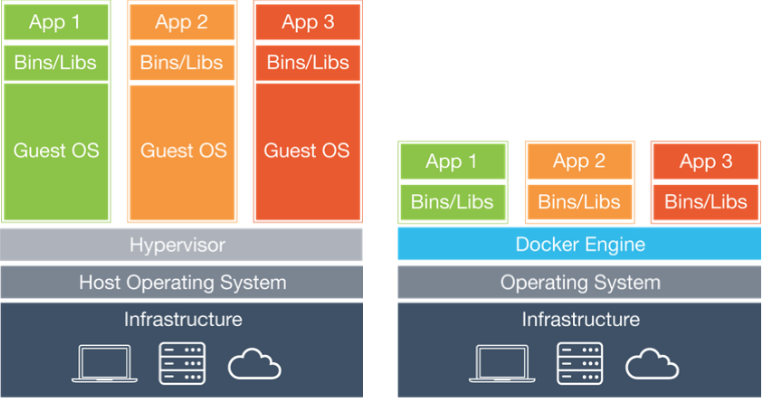

#  1. 도커가 뭐에요...?

## 도입글

2016년, 네트워크 수업을 들으면서 도커와 쿠버네티스를 처음 들어봤다.

신기술 발표로 내가 발표하였지만, 그때는 보여주기식 발표로 내가 접할 일은 없다고 생각했다.

이후 취업을하고 개발을 진행하면서 서버에 있어서 도커의 필요성을 깨닫고, 차근차근 정리하기로 했다. 해당글에는 잘못된 내용을 포함하고 있을 수 있으니, 지속적으로 업데이트를 해보겠다.

# 도커의 전, 후

학부시절, 처음 개발 환경은 LOCAL이라서 굳이 개발환경을 공유할일이 없었다.
하지만 협업을 하거나, 새로운 환경에서 서버를 구축할 시, 기존 메뉴얼 없이 작업을 하다보면 버전이나 환경의 변화가 생기며 충돌이 일어나기 마련이다.
환경설정에 어려움을 겪은 사람이라면, 한번쯤은 관리방식에 대해서 생각해봤을 것이다.

도커가 등장하며, 서버 관리의 방식이 많이 변화했다.
컨테이너라는 개념이 등장하며, 컨테이너안에 물건을 적제하듯 다양한 프로그램, 실행 환경을 컨테이너에 담고 어디서든 실행을 가능하게 만들었다.

학부시절, 운영체제 강의를 들으면서 Oracle Virtual Machine을 사용한 경험이 있다. 아래는 VM과 docker의 동작하는 방식이다.
기존의 VM방식은 HOST OS위에 전체 OS를 가상화한다. 방식은 간단하나 매우 매우 무겁게 느껴진다.

도커가 등장하며, 이러한 가상화의 문제를 해결하였다.
하나의 서버에 컨테이너를 실행하면 서로 영향을 주지 않고 독립적으로 실행된다. 
